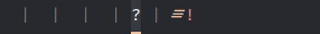

# bddi - BSPWM dynamic desktop icons



This daemon dynamically renames BSPWMs desktops based on what programs are open within them.

(The demo GIF shows Polybar with NerdFont icons being used as the window names)

## How?
The program opens a connection to BSPWMs UNIX socket, which is also how `bspc` communicates with it.  
Via this socket, `bddi` listenes for node events like openening, closing or moving a window.  
When recieved, the nodes open on the desktop associated with the event will be requested, parsed and  
based on this a dynamic name will be generated and set.  
Using an Icon font for the names is recommended.

--- 

This branch holds my initial Python Proof-of-Concept. Recommended if you'd rather run a memory-safe 
language at the cost of some performance.
The file already contains some default icons from [Nerd Fonts](https://www.nerdfonts.com/)..

## Build & Install

### Requirements

* python3
* (optional) A [Nerd Fonts](https://www.nerdfonts.com/) capable font

### Running

Simply run the python file:

```sh
python3 bspwm-dyn-icons.py
```

## Configuration

To add new programs, simply append new key-value-pairs to the `icon_dict` within the python file.
The key being the WM_CLASS value of the target program. The value may be any string.

WM_CLASS is a X11 property associated with each open window.
All windows of a certain program usually hold the same WM_CLASS, so they can be identified.
To find the WM_CLASS_NAME of a program you can use the `xprop` utility.

## Bugs

This is a hobby project and thus comes with absolutely NO WARRANTY.  
I do not in any way claim this program to be free from catastrophic bugs or complete.  
USE AT YOUR OWN RISK.

If you do find errors, please do open an Issue.
I am interested in learning how to do things better.

## Similar Projects

* [btops](https://github.com/cmschuetz/btops) - A more fully featured program providing utility functions for BSPWM. Written in Go.  
